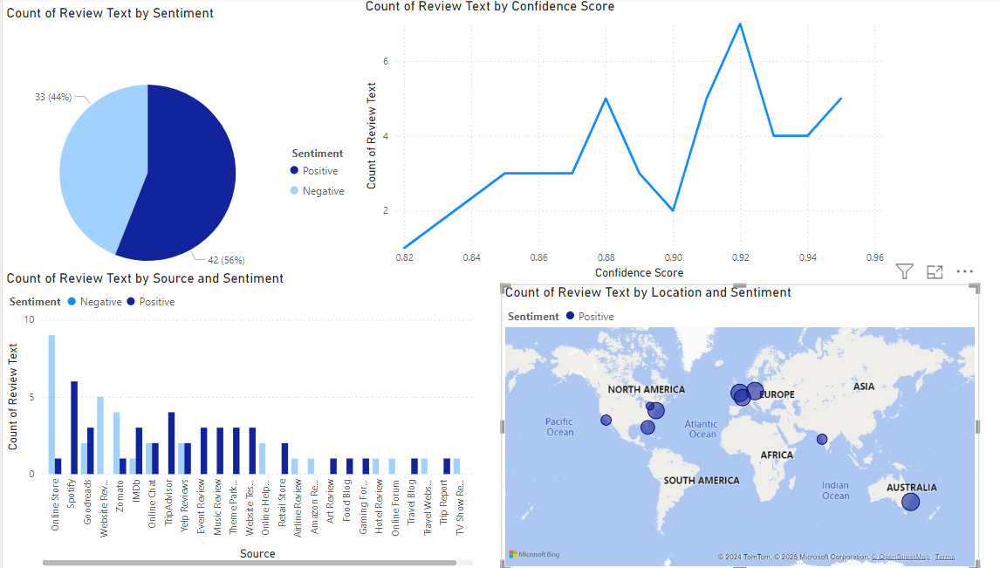

# Sentiment Analysis Dashboard: Exploring Customer Experience

## Overview
This project focuses on sentiment analysis across various sources such as social media, reviews, forums, and more. 
Using **Pandas** and **Python**, we load, clean, transform, and analyze the dataset to visualize customer experience. 
The insights are then presented through interactive **Power BI** dashboards, providing a comprehensive view of sentiments from different platforms.

## Project Highlights
- Sentiment analysis of reviews, social media, forums, and other customer feedback.
- Interactive Power BI dashboards for data visualization.
- Use of Python libraries like **Pandas** and **Matplotlib** for data manipulation and visualization.

---

## Tools and Technologies
- **Python**: For data processing, cleaning, and visualization.
- **Pandas**: For handling, cleaning, and transforming the dataset.
- **Matplotlib**: For basic data visualization in Python.
- **Power BI**: For building interactive dashboards.
- **Dataset**: [Kaggle](https://www.kaggle.com/datasets/vishweshsalodkar/customer-feedback-dataset/data)

---

### Columns in the Dataset:
- `Text`: The review or feedback content.
- `Sentiment`: Sentiment label (Positive, Negative, Neutral).
- `Source`: Platform where the review is collected from (e.g., Twitter, Yelp, etc.).
- `DateTime`: Timestamp of the review.
- `UserID`: Unique identifier for users.
- `Location`: Geographical location of the user.
- `ConfidenceScore`: Confidence score for sentiment analysis.

---
## Power BI - Dashboard

